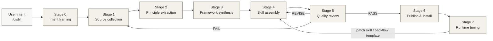
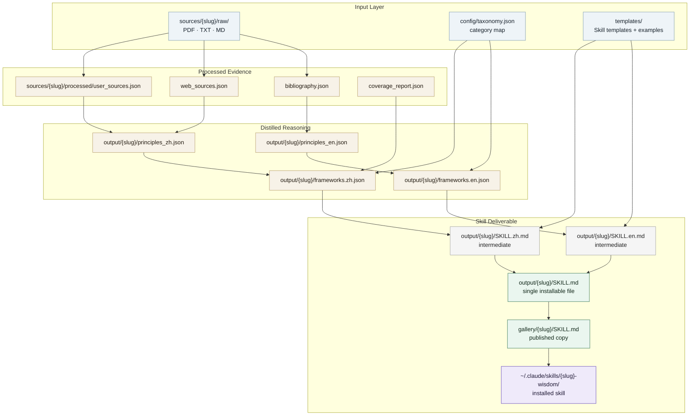
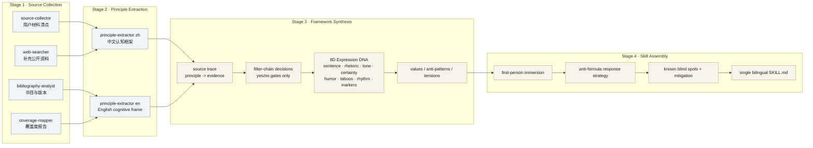
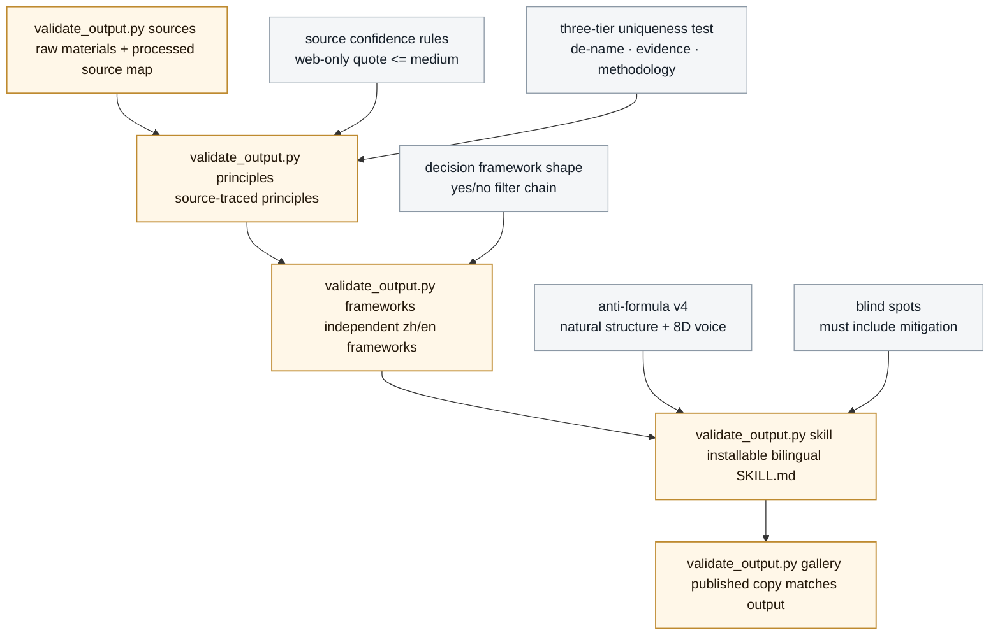
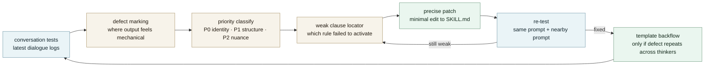
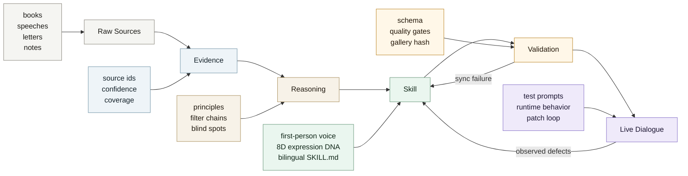

# Mind Distill Factory · Workflow Demo

面向演示的项目工作流图。风格目标是 Claude 式的“清晰、克制、可追踪”：先给一张全局地图，再展示数据产物、质量闸门、运行期调优闭环，最后给出当前发布态检查。

## 1. Factory Spine

这条主干的关键设计不是“生成一个角色提示词”，而是把人物思想压缩成可执行的认知系统：来源证据、原则抽取、双语框架、表达 DNA、盲点缓解、运行期对话测试，全都必须能回到具体文件与校验门。

## 2. Artifact Conveyor

平台约束决定了最后一步的形态：无论中间是否生成独立中文稿和英文稿，Codex/Claude skill discovery 只认目录里的 `SKILL.md`。因此最终发布物必须是一个双语合并文件，并用 `## English` / `## 中文版` 让模型按用户语言自动选区。

## 3. Stage Anatomy

这里最容易误解的是“人物思想蒸馏”不是做文风模仿。真正的核心产物是可执行决策算法：每条原则有证据锚点，每个框架是过滤链，每个表达规则都服务于运行时可用性，而不是装饰性的角色扮演。

## 4. Quality Gates

这些门不是形式检查。它们分别守住四件事：来源可信、方法不泛化、输出能被 skill loader 发现、发布目录与开发产物一致。

## 5. Runtime Tuning Loop

运行期调优是本项目相对成熟的一步：它把“感觉不像、太列表化、太长、引用重复、行动建议单薄”这类主观问题，转化为可定位的规则补丁，而不是继续堆更多抽象原则。

## 6. Current Release Snapshot

| Area                   | Current reading                                                                                                        |
| ---------------------- | ---------------------------------------------------------------------------------------------------------------------- |
| Core pipeline          | 已形成从 `sources/` 到 `output/` 再到 `gallery/` 的完整流水线。                                                                      |
| Skill format           | 当前标准已经收敛到单一 `SKILL.md`，内含英文与中文两套运行规则。                                                                                  |
| Anti-formula v4        | 项目级规则已经要求 8 维 Expression DNA、结构自然性、价值取向与反模式。                                                                           |
| Post-review tuning     | `config/post-review-tuning-guide.md` 已补上运行期对话测试后的精修闭环。                                                                 |
| Mao release gate       | `mao-zedong` 的 sources / principles / frameworks / skill / gallery 五个校验阶段均通过；`output/` 与 `gallery/` 的 `SKILL.md` 哈希一致。 |
| Charlie audit gap      | `charlie-munger` 作为 hand-crafted gallery 基准仍存在，但当前没有对应的 `output/charlie-munger/SKILL.md`，因此无法用同一 gallery 校验链复现。        |
| Install target wording | 项目命令文档使用 `~/.claude/skills/`，当前 Codex 环境强调 `SKILL.md` 发现约束；跨环境演示时应把不变量表述为“local skills directory + exact `SKILL.md`”。  |

## 7. Demo Narrative

演示时可以按三句话讲完整个项目：

1. 先把人物材料变成证据网络，不急着写 Skill。
2. 再把证据网络压缩成双语独立认知框架，并强制每个决策框架变成 yes/no 过滤链。
3. 最后把框架装配成单一 `SKILL.md`，通过质量闸门、gallery 同步、真实对话测试，持续把“像一个报告”调成“像一种可执行的思考方式”。

## 8. Final Workflow Board

