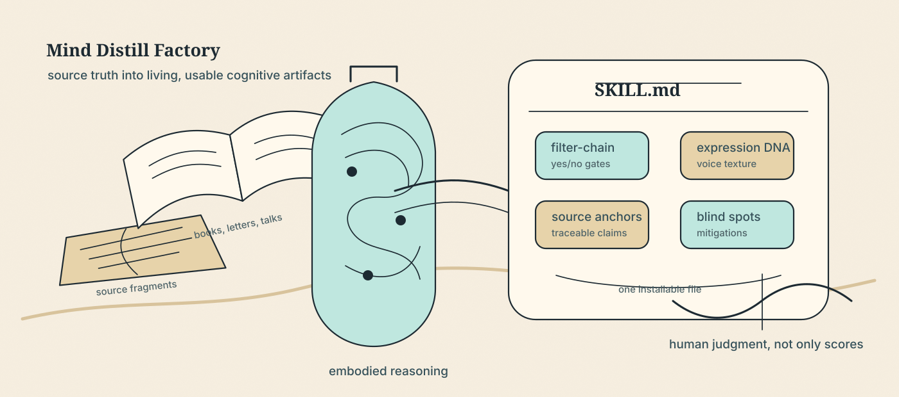
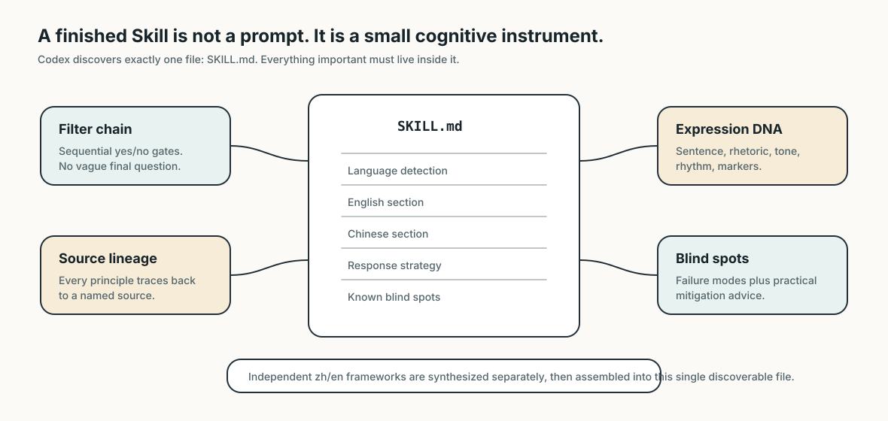
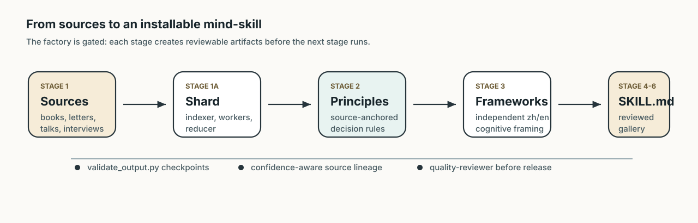
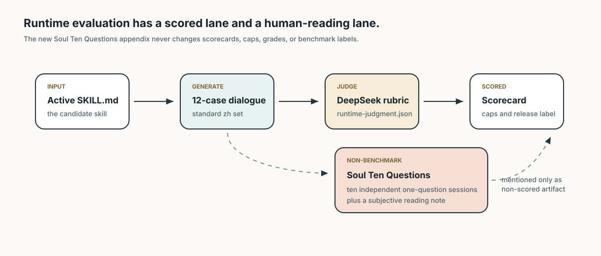
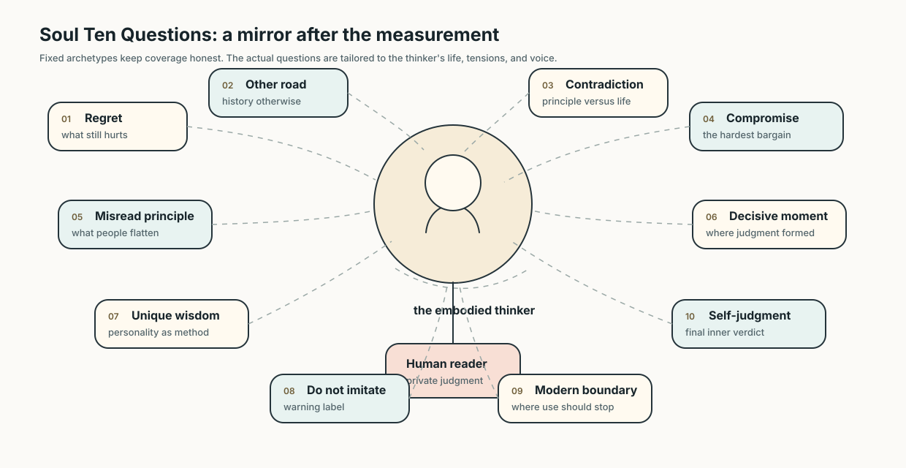

<p align="center">
  
</p>

# Mind Distill Factory · 思维蒸馏工厂

Mind Distill Factory turns a thinker's sources, habits of judgment, voice texture, and failure modes into installable **Codex Skills**.

思维蒸馏工厂把思想家的原始材料、判断习惯、表达质感和失效边界，蒸馏成可安装的 **Codex Skill**。

This project is not a quote shelf, not a biography generator, and not a roleplay costume. Its aim is more demanding: build a small cognitive instrument that can answer from inside a thinker's way of seeing, while staying traceable, useful, and honest about its limits.

Detailed docs: [中文说明](README.zh.md) · [English documentation](README.en.md)

## Why It Exists

Most AI persona prompts stop at surface imitation: famous phrases, a few slogans, and a tone that collapses after the second question. Mind Distill Factory treats a thinker as a working method. It asks:

- What did this person repeatedly notice that others missed?
- Which principles were actually used under pressure?
- Where did the method fail, harden, or contradict the life behind it?
- How should a modern user borrow the wisdom without copying the wound?

The finished Skill should feel less like reading a report and more like holding a disciplined conversation with a mind that has been carefully reconstructed.

## What It Produces

<p align="center">
  
</p>

Codex skill discovery requires exactly one file named `SKILL.md`. This project still builds Chinese and English cognition independently, then assembles both into that single discoverable file.

| Component | What it does |
| --- | --- |
| Filter-chain decision framework | Step-by-step yes/no gates that make the thinker usable for real decisions. |
| Expression DNA | Eight dimensions of voice: sentence patterns, rhetoric, tone, certainty, humor, taboos, paragraph rhythm, and conversational markers. |
| Core principles | Source-anchored rules with modern application scenarios and outcome logic. |
| Reasoning patterns | Repeated cognitive moves: what triggers them, what mental action they perform, and where they appear in the record. |
| Blind spots with mitigation | Known failure modes, when not to use the Skill, and how to counterbalance it. |
| Values and anti-patterns | What the thinker actively pursues, rejects, and never fully resolves. |
| Source lineage | Confidence-aware attribution. User-provided first-hand sources can be high confidence; web-only quotes are capped. |

## How The Factory Works

<p align="center">
  
</p>

The distillation pipeline is gated. It does not let an attractive draft skip source accountability or structural review.

1. Clarify the thinker, slug, language target, and source availability.
2. Collect primary and secondary sources, including local user-provided files when present.
3. Shard large local corpora through indexer, worker, and reducer stages.
4. Extract principles, reasoning patterns, quotes, blind spots, and evidence anchors.
5. Build a shared evidence core, then synthesize Chinese and English frameworks independently.
6. Assemble the final `SKILL.md`.
7. Run quality review, validation, gallery sync, and optional runtime evaluation.

The stable local-source contract is:

```text
sources/{slug}/raw/                 # local materials you provide
sources/{slug}/processed/           # structured extracts
sources/{slug}/processed/user_sources.json
```

## Evaluation

<p align="center">
  
</p>

The evaluator is intentionally separate from the distillation pipeline. It can inspect static artifacts, run DeepSeek-compatible dialogue tests, judge runtime behavior, and produce scorecards without mutating the Skill itself.

The newest appendix is the non-benchmark **Soul Ten Questions** artifact. After a full generated runtime test, DeepSeek can ask and answer ten tailored questions about regret, alternate history, contradiction, compromise, misunderstood principles, decisive moments, unique personality wisdom, warnings against imitation, modern-use boundaries, and final self-judgment.

<p align="center">
  
</p>

This appendix is for private human reading. It does not change `runtime-judgment.json`, `runtime_score_25`, score caps, grades, or benchmark readiness.

## Quick Start

Clone and smoke-test the public toolchain:

```powershell
git clone https://github.com/20240610ldx-hub/Mind-Distill-Factory.git
cd Mind-Distill-Factory
python -m unittest discover -s tests -v
```

Use the `/distill` command from a Codex workflow:

```text
/distill "Sun Tzu"
/distill 王阳明
```

Validate pipeline stages manually:

```powershell
python scripts\validate_output.py sources <person-slug>
python scripts\validate_output.py principles <person-slug>
python scripts\validate_output.py frameworks <person-slug>
python scripts\validate_output.py skill <person-slug>
python scripts\validate_output.py gallery <person-slug>
```

Run runtime evaluation when you have configured a DeepSeek-compatible key locally:

```powershell
Copy-Item evaluation\runtime\.env.example evaluation\runtime\.env
# Edit evaluation\runtime\.env locally. Do not commit it.

python evaluation\runtime\run_dialogue_eval.py --slug <person-slug> --root . --ten-questions auto
python evaluation\scripts\collect_artifacts.py --slug <person-slug> --root . --out evaluation\reports\<person-slug>\artifact-facts.json
```

For deterministic local tests, keep external model calls off:

```powershell
$env:MIND_DISTILL_EVAL_LLM = "off"
python -m unittest discover -s tests -v
```

## Gallery

The public gallery contains installable `SKILL.md` artifacts for:

| Thinker | Skill focus |
| --- | --- |
| Charlie Munger | Multidisciplinary mental models, inversion, business judgment. |
| Chiang Kai-shek | Strategic endurance, organizational reform, weak-side diplomacy. |
| Mao Zedong | Contradiction analysis, investigation, underdog strategy. |
| Richard Feynman | First principles, scientific honesty, learning by explanation. |
| Sun Tzu | Competitive strategy, positioning, deception, timing. |
| Wang Yangming | Conscience, unity of knowledge and action, moral self-cultivation. |
| Zeng Guofan | Self-discipline, talent judgment, patience under pressure. |

## Debate Arena

The `debate_arena/` package lets two Skills argue a topic through structured roles: profiler, topic generator, debaters, fact checker, and judge.

```powershell
python -m debate_arena run --llm fake --issues 3 --out output\debate_arena\dry_run.md
```

For real runs, set `DEBATE_ARENA_API_KEY` or `OPENAI_API_KEY`. See [debate_arena/README.md](debate_arena/README.md).

## Public Release Boundary

This repository is the public engineering surface. It includes templates, orchestration contracts, evaluator code, gallery Skills, diagrams, and tests. It intentionally excludes local secrets, private source corpora, generated reports, release-video working files, and paid runtime outputs.

The MIT license applies to the code and documentation in this repository. It does not grant rights to third-party books, PDFs, recordings, scans, or other materials used privately during distillation.

## Repository Map

```text
agents/         Subagent contracts for extraction, synthesis, review, and assembly
commands/       The /distill orchestration command
config/         Taxonomy and defaults
debate_arena/   Two-Skill debate runner
docs/assets/    Public README and project images
evaluation/     Standalone SkillEval-MDF runtime and artifact evaluator
gallery/        Released installable Skills
scripts/        Validators, source processing, and utility scripts
sources/        Public placeholder plus local-source contract
templates/      Skill templates and hand-crafted examples
tests/          Regression tests
```
