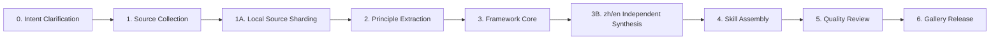

<p align="center">
  
</p>

# Mind Distill Factory · 思维蒸馏工厂

Mind Distill Factory distills the decision frameworks, reasoning patterns, expression style, and value orientation of major thinkers into installable **Codex Skills**.

思维蒸馏工厂把重要思想家的决策框架、推理模式、表达质感与价值取向，蒸馏为可安装的 **Codex Skill**。

This is not a quote collection or biography generator. The goal is an executable reasoning artifact: the Skill responds from a first-person immersive perspective, using the thinker's cognitive framework while preserving practical, constructive guidance.

这不是名言汇编，也不是传记生成器。目标是可执行的认知工件：Skill 以第一人称沉浸视角回应，内化思想家的判断框架，同时保持建设性的行动导向。

Deep docs: [English](README.en.md) · [中文](README.zh.md)

## What It Produces

Each finished Skill is a single `SKILL.md` because Codex skill discovery requires that exact filename. Bilingual cognition is still built independently: Chinese and English frameworks are synthesized separately, then assembled into one installable file with language-aware sections.

每个最终 Skill 都是单个 `SKILL.md`，因为 Codex 只识别这个文件名。中英文框架仍然独立合成，不是互译；最终再合并为一个可安装文件。

| Artifact | Purpose |
| --- | --- |
| Filter-chain decision framework | Step-by-step yes/no gates, not vague open-ended questions. |
| Expression DNA | 8 dimensions of voice: sentence pattern, rhetoric, tone, certainty, humor, taboos, paragraph rhythm, conversational markers. |
| Core principles | Source-anchored decision rules with modern scenarios and outcome logic. |
| Blind spots | Known failure modes with mitigation advice and "when not to use" guidance. |
| Values and anti-patterns | What the thinker pursues, rejects, and leaves unresolved. |
| Source lineage | Confidence-aware attribution from user-provided and researched sources. |

## Pipeline



The local-source path uses indexer, bounded shard workers, and reducer stages so a large corpus does not go through one oversized agent. The stable local contract is `sources/{slug}/processed/user_sources.json`.

本地大语料不会交给单个超大 agent，而是经过索引、受控分片 worker、汇总 reducer。稳定的本地契约是 `sources/{slug}/processed/user_sources.json`。

## Quality Gates

Before a Skill enters `gallery/`, it must pass the project gates:

| Gate | Requirement |
| --- | --- |
| Source traceability | Every principle must trace to a specific source. |
| Quote confidence | Web-only quotes are capped at low/medium confidence. |
| Decision structure | Framework steps must be filter gates. |
| Bilingual framing | Chinese and English frameworks are independently synthesized. |
| Blind spots | Each blind spot includes mitigation advice. |
| Anti-formula quality | Expression DNA and structural naturalness rules must be present. |
| Gallery integrity | Final gallery Skill must match the reviewed release artifact. |

Run the core checks:

```powershell
python -m unittest discover -s tests
python scripts\validate_output.py skill zeng-guofan
```

## Gallery

| Skill | Status | Notes |
| --- | --- | --- |
| `mao-zedong-wisdom` | Pipeline release | Strategy, governance, philosophy. |
| `sun-tzu-wisdom` | Pipeline release | Strategy with independent zh/en frameworks. |
| `wang-yangming-wisdom` | Pipeline release | Philosophy, conduct, resilience. |
| `zeng-guofan-wisdom` | Pipeline release | Conduct, governance, resilience. |
| `chiang-kai-shek-wisdom` | Pipeline release | Governance, strategy, resilience. |
| `richard-feynman-wisdom` | Pipeline release | Inquiry, pedagogy, conduct. |
| `charlie-munger-wisdom` | Legacy reference | Hand-crafted early example; not a current v4 pipeline benchmark. |

Installable Skills live under `gallery/{person-slug}/SKILL.md`.

## Quick Start

Use the `/distill` command in a Codex-style workflow:

```text
/distill "Sun Tzu"
/distill 王阳明
```

For local source-first distillation, place lawful source files under:

```text
sources/{person-slug}/raw/
```

Then follow the staged validators:

```powershell
python scripts\validate_output.py sources <person-slug>
python scripts\validate_output.py principles <person-slug>
python scripts\validate_output.py frameworks <person-slug>
python scripts\validate_output.py skill <person-slug>
```

## Debate Arena

`debate_arena` runs two Skills against each other with deterministic dry runs or OpenAI-compatible model backends.

```powershell
python -m debate_arena run --llm fake --issues 3 --out .\output\debate_arena\dry_run.md
```

Default participants live here:

```text
debate_arena/
  skills/
    skill_a/
      SKILL.md
    skill_b/
      SKILL.md
```

For real runs, set API credentials in your shell or a local env file that is not committed:

```dotenv
DEBATE_ARENA_LLM=openai
DEBATE_ARENA_API_KEY=
DEBATE_ARENA_BASE_URL=https://api.openai.com/v1
DEBATE_ARENA_MODEL=gpt-4.1-mini
```

## Public Release Boundary

This public repository is the lean OSS release. It intentionally excludes:

- `sources/` raw corpora
- `output/` intermediate artifacts
- `release-video/` media production files
- local `.env` files and `.claude/` settings
- runtime reports, PDFs, audio, video, PPTX files, and cache files

The MIT license applies to the code and documentation in this repository. It does not grant rights to third-party books, PDFs, recordings, scans, source corpora, or media assets used locally during distillation.

本仓库的 MIT 许可只覆盖仓库内代码与文档，不覆盖本地蒸馏过程中使用的第三方书籍、PDF、录音、扫描件、语料或媒体素材。

## Repository Map

```text
agents/        Distillation subagent definitions
commands/      The /distill orchestration command
config/        Taxonomy and defaults
debate_arena/  Two-skill debate runner
evaluation/    Independent evaluator tooling
gallery/       Released installable Skills
scripts/       Validators and pipeline utilities
templates/     Skill templates and examples
tests/         Unit tests
```
